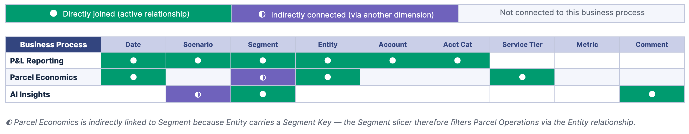
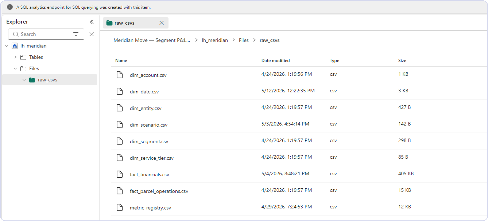
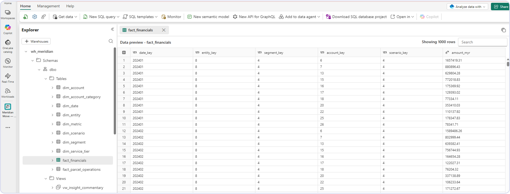
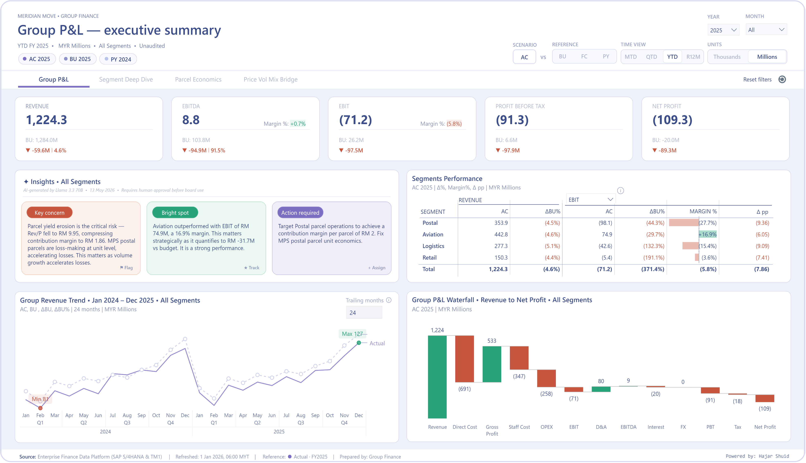
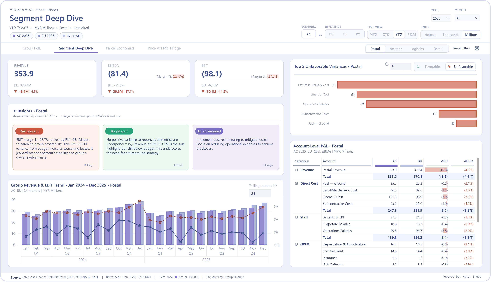
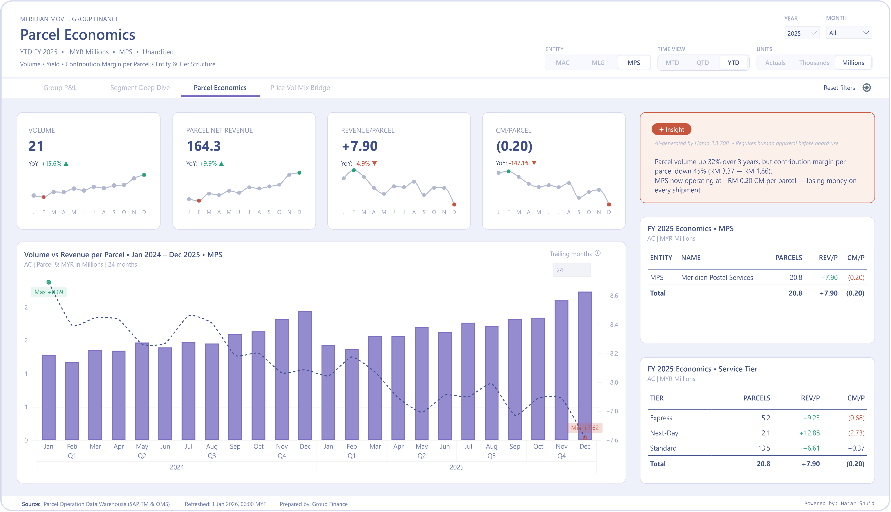
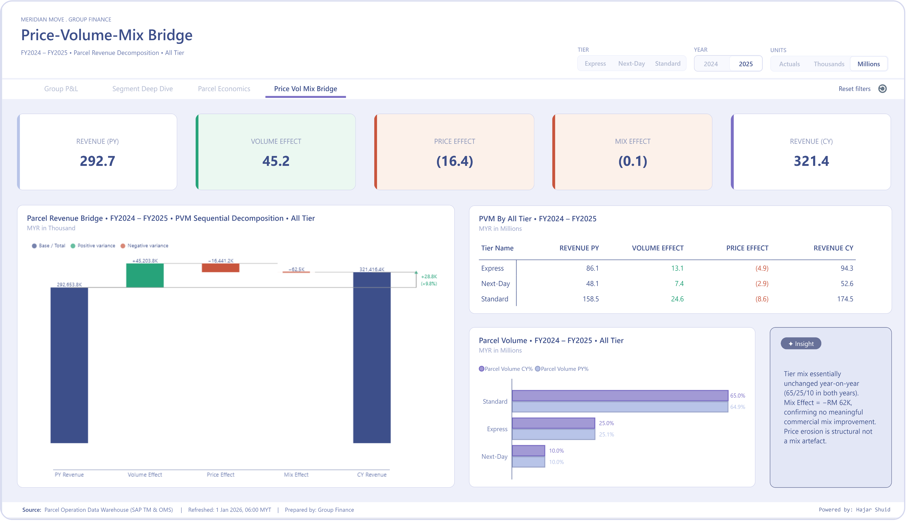

# Financial Performance Management & Segment Profitability Analysis

> An end-to-end financial analytics solution for a synthetic regional postal & logistics group, built on Microsoft Fabric with Power BI, DAX, and an AI-assisted commentary pipeline.

**[ Report visualization ](#report)**


## What this is

A four-view finance "command centre" that takes raw financial and operational data through a complete analytics workflow:


It is built around a fictional company, **Meridian Move Berhad**, whose financials are synthetic but modelled on a real listed postal operator's public results (~RM 1.2B revenue, operating at a loss and mid-transformation).

The project demonstrates the skills a finance analytics function actually needs: building a trustworthy semantic model, encoding finance logic correctly in DAX, designing dashboards executives will actually read, and integrating an LLM responsibly.

> **Note on data:** All data is synthetically generated by the included Python script. The company, entities, and figures are fictional, modelled on publicly available financials of a listed operator to keep the analytical patterns realistic. Not affiliated with any real company.


## The headline insight

The dashboard is built to surface one conclusion that raw P&L statements hide:

**Parcel volume is growing ~15% per year, but contribution margin per parcel has fallen ~45% over three years (RM 3.37 → RM 1.86). At the postal entity (MPS), contribution margin per parcel has turned *negative* (−RM 0.20).**

In other words: the business is growing a loss-making product line, and volume growth is *destroying* value rather than creating it. At ~20.8M parcels through the postal entity, that is roughly RM 4M of annual value erosion that headline revenue growth was masking. The Parcel Economics and Price-Volume-Mix pages are designed so a viewer reaches that conclusion in a few clicks.


## Data & Architecture

### Logical data model (Bus matrix)


### Technical architecture diagrma





**Design decisions worth noting:**

- **Direct Lake** mode — queries the Lakehouse Delta tables directly, no import refresh, no DirectQuery latency.
- **Star schema** with conformed dimensions (date, segment, entity, account, scenario, service tier) so the grain is explicit and relationships stay single-direction **1-to-Many (1:*)**.
- **Calculation groups** for Scenario (Actual/Budget/Forecast/PY), Time Intelligence (MTD/QTD/YTD/Rolling 12M/vs PY), and Display Unit (Actuals/Thousands/Millions) — one slicer reshapes every measure instead of duplicating measures per variant.
- **Parameters** (Field & Numeric) — a Field Parameter lets a single slicer swap the breakdown axis across visuals (revenue, profit) without duplicating pages; a Numeric Parameter exposes a what-if input (e.g., trailing months, ranking for favorable & unfavorable) so stakeholders can stress-test scenarios directly in the report without touching the data model.
- **Row Level Security** (segment, entity) — static RLS roles map each user to their permitted segment(s) and entity(ies), so segment controllers on Page 2 (Segment Deep-Dive) and commercial leads on Page 3 (Parcel Economics) each land in a pre-filtered view of the same report; the Group CFO role is unrestricted for the full cross-segment P&L on Page 1.
- **Metric registry** — a metadata table defining each metric's format, sign convention, P&L section, and KPI flag, designed to drive dynamic P&L hierarchies and be reused across projects.


## The four pages

| Page | Audience | What it answers |
|------|----------|-----------------|
| **1 · Group P&L Executive Summary** | Group CFO / ExCo | "How is the whole company doing right now?" Dynamic KPI cards, 13-stage P&L waterfall (Revenue → Net Profit), segment matrix with EBIT/EBITDA toggle, AI insight cards. |
| **2 · Segment Deep-Dive** | Segment controllers | "Why is my segment off budget?" Auto-ranked favourable/unfavourable account variances (RANKX), combined revenue + EBIT trend, full account-level P&L matrix. |
| **3 · Parcel Economics** | Commercial / Pricing | "Are we growing parcels profitably?" Unit economics (volume, yield, CM per parcel), dual-axis volume-vs-yield trend, entity and service-tier breakdowns. |
| **4 · Price-Volume-Mix Bridge** | CFO / Strategy | "What drove the revenue change?" Sequential PVM decomposition (volume / price / mix effects) with reconciliation, waterfall bridge, tier-level detail. |


## Technical highlights

**DAX**
- Full profitability ladder (Gross Profit → EBITDA → EBIT → PBT → Net Profit) with margin variants
- Variance measures respecting cost sign convention (favourable always = improves EBIT)
- RANKX-based auto-ranking of account variances, re-computing per segment via `ALLSELECTED`
- Price-Volume-Mix decomposition wrapped in `REMOVEFILTERS('Display Unit')` to keep the count×currency math immune to the unit-display calc group — a non-obvious interaction bug, documented in the case study
- Time intelligence (YTD, Rolling 12M, YoY%) with `ISBLANK` guards for missing prior-year periods

**Semantic modelling**
- Disconnected tables for the P&L waterfall stages and PVM bridge stages (SWITCH-driven value measures)
- Sort-by columns, hidden technical keys, display folders organised by function

**AI commentary pipeline** (`notebooks/`)
- Fabric notebook queries the model for key metrics, prompts an LLM (Groq / Llama 3.3 70B) for structured JSON commentary (concern / bright spot / action), and writes results to a Delta table read by the report via Direct Lake
- Prompt engineered with anti-hallucination guardrails (the model can only describe metrics it is given) and an `is_approved` human-in-the-loop flag before commentary reaches a board pack
- LLM-agnostic by design — swapping Groq for Azure OpenAI or Claude is a config change


## Repository structure

```
segment_profitablility_project/
├── generate_meridian_data.py          # Synthetic data generator (36 months, baked-in stories)
├── data/                              # Generated CSVs (fact + dimension tables)
│   └── metric_registry/               # Reusable metric definitions table
├── sql/
│   ├── 01_create_schema.sql           # Warehouse star-schema DDL
│   ├── 02_data_validation.sql         # Truth-set validation queries
│   └── 03_migrate_to_actuals.sql      # Column migration (thousands → actuals)
├── notebooks/
│   └── generate_financial_commentary_v2.py   # LLM commentary pipeline (complete)
├── theme/
│   └── meridian_theme.json            # Power BI theme (colour palette, fonts)
└── docs/
    ├── Meridian_Move_PnL_Data_Dictionary.docx
    └── metric_registry_guide.md       # Metric registry schema + usage patterns
```


## Reusable assets

Three artifacts here are deliberately built to outlive this project:

1. **`data/metric_registry/`** — a metric metadata registry with a documented schema, portable to any finance project by swapping rows.
2. **`generate_meridian_data.py`** — a parameterised synthetic finance data generator producing realistic 3-year monthly data with intentional narratives (margin compression, a dry-dock event, budget optimism bias, tax and FX at the entity level).
3. **`Meridian_Move_PnL_Data_Dictionary.docx`** — documenting a semantic model with 25 tables, 117 columns, and 180 DAX measures. This data dictionary captures the full model structure — table definitions, column descriptions, and plain-English DAX logic — as a reference for anyone building on or maintaining the report.


## Tech stack

`Microsoft Fabric (Lakehouse, Warehouse, Notebooks)` `Power BI (Direct Lake)` `DAX` `Tabular Editor 2` `Calculation Groups` `Deneb (Vega-Lite)` ` Groq API (Llama 3.3 70B)`  `Python (pandas)` `SQL`


## Report

[Interactive Report ↗](https://app.powerbi.com/view?r=eyJrIjoiMzJmNzhiNDYtNDZiMS00NDAyLWJiZDUtZjZmY2VmMGM1MDRjIiwidCI6ImFlYmMzMTg4LWU3MzYtNGRlYi05MzJiLWRjNDU5OGMwNDQ3ZCIsImMiOjN9)


1. **Page 1 — Group P&L Executive Summary**
   

2. **Page 2 - Segment Deep Dive**
   

3. **Page 3 — Parcel Economics**
   

4. **Page 4 — PVM Bridge**
   


---

## A note on scope and honesty

This is a portfolio project, and a few framings are deliberately precise:

- The data is **synthetic**, generated to be realistic — not real company data.
- The dashboard is **IBCS-*influenced*** (consistent AC/BU/FC/PY notation, Δ and Δpp variances, self-describing chart context) — not formally IBCS-compliant.
- The LLM pipeline is a **working prototype** with production-minded guardrails, not a deployed production system.

These distinctions are the point: knowing where the line is between "demonstrated" and "production-grade" is part of the craft.
